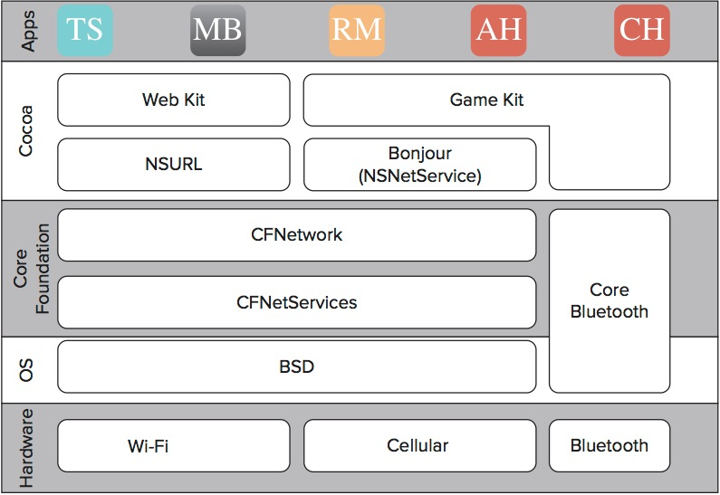

##第一章 iOS网络性能介绍

####本章概要：

1、了解iOS网络框架

2、开发者可用的主要网络API

3、有效用于程序的run loop

优秀的iOS应用需要一个简单且直观的的用户界面。同样的，具有同web服务器进行通信的优秀应用也需要一个良好架构的网络层。设计一个应用的架构时，必须考虑到适应需求变更的灵活性和正确处理不断变化的网络条件，同时还要维持核心设计原则，即合适的可维护性和可扩展性。

要设计一个移动应用的架构，你必须牢固掌握核心概念，例如run loop, 多种可用的网络API，以及如果把这些API们同run loop 整合起来后制作一个响应式网络应用框架。
本章详细的探讨了run loop和如何在应用中有效的使用run loop。也对重要的API有概要说明并介绍了这些API使用的场合和时机。

####了解网络框架

在开发和网络交互的iOS应用之前，你必须了解Objective-C中网络层的组成划分，如下图：

每一个iOS应用都位于由四层结构组成的网络框架栈的顶部。网络框架栈最上层是Cocoa层，它包含了Objective-C中关于`URL加载`，`Bonjour`, `Gami Kit`的API。在Cocoa层下方是Core Foundation层，它由C语言的API组成，包含`CFNetwork`,这是大部分应用层网络代码的基础。CFNetwork在CFStream和CFSocket之上提供了一个简单的网络接口。`CFStream`和`CFSocket`都是对`BSD socket`进行轻量级的封装，BSD socket位于最低的一层，并离天线硬件最近。BSD socket完全用C实现，并提供给开发者全部权限来与远程设备或服务器通信。


随着框架栈往下走，越往下控制权会越高，但是也放弃了使用的舒适感和易用性。
虽然有很多可行的解决方案，但是苹果公司推荐使用CFNetwork层及以上。BSD层的raw socket 不能访问系统VPN，也不能激活WiFi或蜂窝数据，这些都是由CFNetwork来处理的。

在你设计应用的网络层之前，你必须了解大量对你有用的API，并知道如何融会贯通。下一节会介绍主要的iOS网络框架，以及如何使用它们。每个API都将在后续章节详细讲解。


####iOS网络APIS

框架栈的每一层都有一堆关键API来为开发者提供相关的功能和控制。每一层都会比上一层多一些封装。不过封装之后会丧失一些控制权。 这一章简述了iOS中的关键API和何时使用的概览。


#####NSURLConnection

NSURLConnection是一个Cocoa层的API，提供了一个简单的方法来读取URL请求，
用来和web服务器交互，抓取图片、视频或者简单的检索一个格式化HTML文档。
NSURLConnection构建在NSStream之上，并优化了对四种最常用的URI格式的支持(文件，HTTP，HTTPS，FTP)。
虽然NSURLConnection限制了可以使用的协议，但它封装了很多更底层的、需要从缓冲区读写的工作，包括内置认证(authentication)和提供一个健壮的缓存引擎。

NSURLConnection接口比较少，它重度依赖于NSURLConnectionDelegate协议，通过这个协议能使应用程序介入网络连接生命周期的许多点之间。NSURLConnection请求默认是异步的。但是，也有方便的方法来发送同步请求。同步请求会阻碍调用的线程，因此你必须合理设计应用程序。第三章“发起请求”中详细描述了NSURLConnection并提供了许多例程。

#####Game Kit

本质上来说，Game Kit是为iOS应用提供了另一个对等网络选项。在传统网络结构中，Game Kit是构建在Bonjour之上的，但是Game Kit并不完全依赖于网络基础设施。它能创建ad-hoc蓝牙私有区域（Bluetooth Personal Area Networks，PAN），可以让设备在只有少量或者没有网络基础设施的区域进行通讯。

Game Kit只需要一个会话id（session identifier）,显示的名称和配置网络时的连接模式。它不需要socket，或与已连接的对象进行其他底层网络通讯。Game Kit通过GKSessionDelegate协议通信。第12章“通过Game Kit进行设备之间的通信”详述了如何将Game Kit集成到应用中。

#####Bonjour

Bonjour是苹果公司关于零配置网络服务（注：一种用于自动生成可用IP地址的网络技术，不需要额外的手动配置和专属的配置服务器）的实现。Bonjour提供一个机制来发现和连接设备（或网络），而并不需要知道设备网络地址。相反，Bonjour指的是一组由名称、服务类型和域组成的服务。Bonjour封装了底层网络通信所需的组播DNS（multicast DNS, mDNS）和DNS服务发现（DNS-SD）。

在Cocoa层中，NSNetService API 提供一个接口来发布和解析Bonjour服务的地址信息。你能使用NSNetServiceBrowser API来发现网络中的可用服务。即使是使用Cocoa层的API来发布一个Bonjour服务，也需要对Core Foundation有所了解，才可以配置连接的socket.第13章“使用Bonjour来搭建Ad-Hoc服务”详述了零配置网络服务Bonjour，以及如何实现基于Bonjour服务。

#####NSStream

NSStream是Cocoa层的API，构建与CFNetwork之上，是NSURLConnetion的基础部分，用于底层网络任务。NSStream更像是NSURLConnection，它提供一个和远程服务器(或本地文件)的通信机制。而且，你能使用NSStream和一些协议（如telnet、SMTP等）进行通信，但是NSURLConnection并不支持这一点。

NSSteam还提供了一些额外的控制，但是会有一些开销。NSStream并不支持处理HTTP（或HTTPS）的响应状态码或身份认证(authentication challenge)。它发送和收到的数据都是C缓冲区(C buffer)，这个对纯Objective-C开发者而言会有些陌生。它也不能管理多路出站请求，如果需要的话则要子类化后再增加相应功能。NSStream是异步的，通过NSStreamDelegate进行通信。第8章“底层网络通信”和第13章“使用Bonjour来搭建Ad-Hoc服务”提到了NSStream的不同实现。

#####CFNetwork

CFNetwork API位于基础BSD socket之上，用于NSStream、URL加载系统、Bonjour和Game Kit 等API的实现。它支持高级协议如HTTP和FTP。CFNetwork和BSD socket不同之处在于run loop集成。如果你的应用使用CFNetwork，输入和输出事件都是在线程的run loop中依序进行。如果输入和输出事件在另外的线程中发生，有必要在合适的模式下开启run loop。“Run Loops”部分稍后详述 。
 
CFNetwork提供比URL加载系统更多的配置项，这有利有弊。当通过CFNetwork创建一个HTTP请求时，这些配置项都是可见的。创建请求时必须手动添加HTTP头和cookies,然后随着请求一起提交。但是使用NSURLConnection时，标准头和在cookier jar中的其他cookies都已经自动添加好了。

CFNetwork基础设施是构建在Core Foundation层的CFSocket和CFStream的API之上的。CFNetwork包含指定协议的API，例如和FTP服务器通信的CFFTP协议，发送和接受HTTP消息的CFHTTP协议，发布了浏览Bonjour服务的CFNetService协议。第8章详述了CFNetwork，第13章简要介绍了Bonjour.

#####BSD Sockets

BSD socket 为许多网络活动提供最基础服务，也是网络框架中最底层的了。BSD socket是用C实现的，但是可以和Objective-C一起使用。苹果并不推荐使用BSD socket API，因为它在操作系统中没有任何hook。例如,BSD socket既不走系统VPN的通道也没有任何API来自动激活被关闭的WIFI或者蜂窝设备。苹果公司推荐使用CFNetwork或者更高层的API。第8章中详述了BSD socket和CFNetwork并提供了如何把它们整合进应用程序的例子。

随着学会多种网络API的使用，开发者也必须了解如何把它们整合进应用程序。下一章节讨论了run loop的概念，它从操作系统中检测网络事件（在其他事情中），并转发到我们的程序。

####RUN LOOPS

Run loop的对应类是NSRunLoop，是线程的一个基础组件，使得操作系统能够唤醒沉睡的线程，从而管理发生的事件。一个run loop是在一段时间内通过一个循坏配置来管理任务和处理到来的事件。iOS程序中的每个线程最多有一个run loop。主线程中的run loop是默认开启的，在应用的delegate方法applicationDidFinishLaunchingWithOption:调用之后，主线程的run loop就可以被访问到了。

其他线程，如果需要使用run loop 则需要开启它们的run loop。在开始一个run loop之前，必须添加至少一个输入源或timer，否则run loop会立即退出。Run loop提供给开发者们和线程通信的能力，但是这不是必要的。如果线程经常被用于处理大量数据，而不需要和其他线程通信，就不需要run loop。但是如果其他线程需要和网络通信，则需要开启run loop。

run loop接收事件有两种源类型：输入源和计时器(timer)。输入源通常有两种，要么是基于端口的要么是自定义的，都是异步给程序发送事件。两个源类型主要的不同在于基于端口的内核信号源是自动的，而自定义的源必须在不同的线程中手动管理。可以通过实现CFRunLoopSourceRef的多个回调函数来创建一个自定义输入源。

计时器实际上是一个基于事件的通知，它为应用（特指线程）提供一个在未来时间内执行特定任务的机制。计时器事件是同步发送的，也和特定的模式相关，这个将在后续章节中讨论。如果不是当前监听的特定模式，事件将会被忽略，线程也不会被通知，直到run loop在相关模式中处于运行时。

你能配置计时器使其运行一次或多次。它会基于计划好的执行时间来重订时间，而不是现在的执行时间。如果一个计时器执行时，run loop正在执行一个程序处理的方法，计时器将跳过这次，等到run loop下次调用计时器的时候,计时器通常通过@selector()来设置。如果执行操作被延迟到下个调用发生时，计时器也只会调用一次被延迟的事件。

Run loop也能够放置观察者，这不是为对象监视run loop ，而是当run loop上有某些事情发生时提供一个方法来收到回调。这些事情包括进入run loop模式（或退出）,run loop睡眠（或唤醒），以及在run loop处理一个输入源或计时器之前。这些事情都在枚举类型CFRunLoopActivity中列出来了。观察者可以配置来执行一次，即观察者执行之后被移除，也可以重复执行。要添加run loop观察者，使用Core Foundation方法CFRunLoopObserverRef().

#####Run Loop 模式

通过run loop执行的每一次（pass）都运行在你指定的特定模式下。run loop模式是一个用于操作系统的约定，用来过滤被监控和被允许用来传递事件的源，例如调用delegate方法。模式包含本应该被监控的输入源和计时器，就像本应该在run loop事件中被通知的其他观察者一样。

iOS中有两种预定义的run loop模式。NSDefaultRunLoopMode（等同于Core Foundation中的kCFRunLoopDefaultMode）是系统默认模式，也常在启动run loop和配置输入源中被用到。
NSRunLoopCommonModes(等同于Core Foundation中的kCFRunLoopCommonModes)是一个可配置的模式的集合。对一个NSRunLoopCommonModes调用方法（例如scheduleInRunLoop:forMode:）指定一个输入源并把它和当前组中的所有模式关联起来。

	提醒 OSX包含三种额外的预加载run loop模式，可以在相关文档中找到。这三种分别是 NSConnectionReplyMode, NSModalPanelRunLoopMode, 和 NSEventTrackingRunLoopMode，它们提供了额外的过滤选项，但是它们都不能用于iOS.

虽然NSRunLoopCommonModes是可配置的，但它是一种底层过程，需要调用Core Foundation方法CFRunLoopAddCommonMode()。这样可以通过新模式自动注册输入源、计时器和观察者，而不是手动添加到每一个新模式中。你能通过指定一个自定义字符串（例如CustomRunLoopMode）来自定义run loop 模式，但是必须添加至少一个输入源、计时器或者观察者。

虽然这只提供了一个run loop的概述，苹果公司提供了关于run loop管理的多种深度资源，以便于开发更高程度、基于网络和多线程应用时学习。开发者文档位于<https://developer.apple.com/library/mac/#documentation/Cocoa/Conceptual/Multithreading/RunLoopManagement/RunLoopManagement.html>。受益于run loop集成的网络技术将会在后续章节（例如第8章“底层网络”和第13章“使用Bonjour来搭建Ad-Hoc网络”）中有所讨论。

####总结
了解了iOS网络栈和应用如何同run loop交互，这为iOS开发者提供了重要的工具。一个良好架构的网络层可以为应用程序提供极大的灵活性。同样，糟糕架构的网络层也会损害灵活性和可扩展性。

本章所述的工具，展现了各种网络API的情况和差异。本章只做简述，详述参见后续章节。